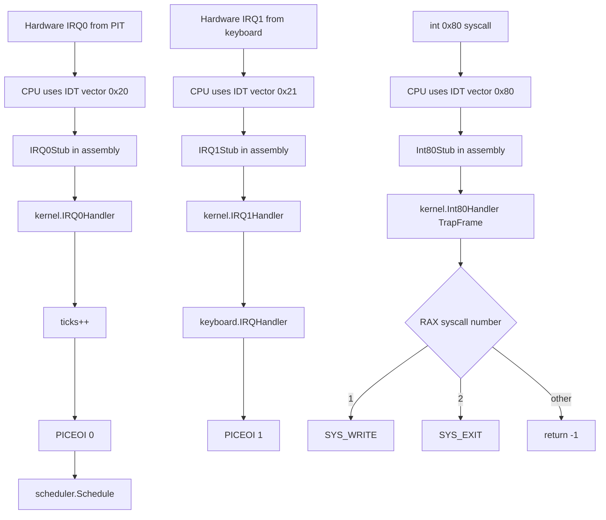
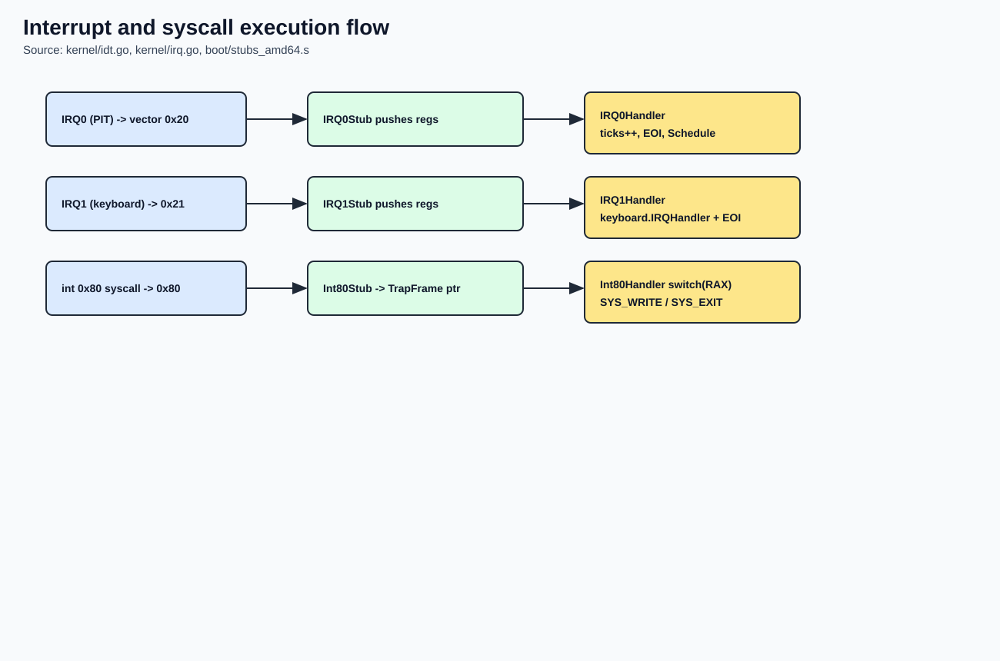
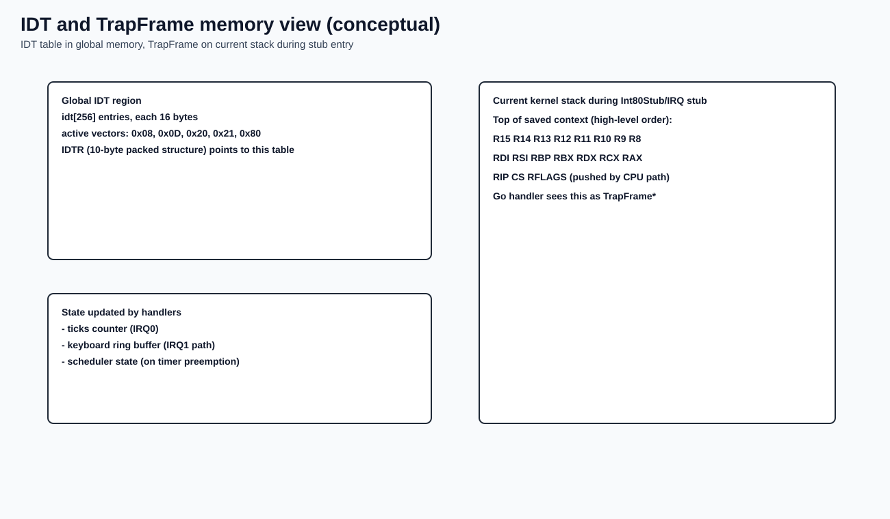

# Interrupts, PIC, PIT, and Syscalls

## Why this chapter matters

Interrupt and syscall paths are where control flow becomes non-linear.
Understanding these paths is essential to reason about responsiveness, scheduling, and task lifecycle.

## Source anchors (exact code references)

- IDT structures and setup: `kernel/idt.go:10` to `kernel/idt.go:166`
- IRQ handlers: `kernel/irq.go:10` to `kernel/irq.go:22`
- PIC remap/mask/EOI: `kernel/pic.go:15` to `kernel/pic.go:44`
- PIT configuration: `kernel/pit.go:5` to `kernel/pit.go:15`
- Assembly stubs:
  - IDT load/store: `boot/stubs_amd64.s:240` to `boot/stubs_amd64.s:252`
  - Syscall stub: `boot/stubs_amd64.s:254` to `boot/stubs_amd64.s:267`
  - IRQ stubs: `boot/stubs_amd64.s:386` to `boot/stubs_amd64.s:424`

## Theory companion

For deeper architecture background, see:

- `docs/manual/03-kernel-core/theory-reference.md#1-interrupts-exceptions-and-traps`
- `docs/manual/03-kernel-core/theory-reference.md#2-idt-basics`
- `docs/manual/03-kernel-core/theory-reference.md#3-irq-and-pic-model`
- `docs/manual/03-kernel-core/theory-reference.md#4-pit-timer-model`
- `docs/manual/03-kernel-core/theory-reference.md#5-syscall-model-in-this-project`
- `docs/manual/03-kernel-core/theory-reference.md#6-trap-frame-concept`

## IDT model in this kernel

- `idtSize = 256`
- each x86_64 IDT entry is 16 bytes (`idtEntry`)
- currently installed vectors:
  - `0x08` double fault
  - `0x0D` general protection fault
  - `0x20` IRQ0 timer
  - `0x21` IRQ1 keyboard
  - `0x80` syscall gate (`DPL=3`)

`InitIDT()` builds entries, packs a 10-byte IDTR, then calls `LoadIDT`.

Practical interpretation:

- IDT is the dispatch table for both hardware IRQs and software `int 0x80`.
- Handler privilege (`DPL`) controls who is allowed to trigger a gate from software.
- Vector choice is a kernel ABI decision: changing it affects stubs and callers.

## PIC and PIT responsibilities

- PIC is remapped to avoid overlap with CPU exceptions:
  - master offset `0x20`
  - slave offset `0x28`
- PIT channel 0 is programmed at ~100 Hz
- IRQ0 increments `ticks` and triggers scheduler
- IRQ1 reads keyboard scancode into buffer

Practical interpretation:

- PIC remap avoids clashing with CPU exception vectors.
- PIT frequency determines time granularity and preemption cadence.
- Sending EOI is mandatory to keep interrupt delivery flowing.

## Interrupt/syscall flow (Mermaid)

Rendered image:

## Trap frame and IDT memory model

`Int80Stub` saves register state and passes the saved frame pointer to Go handler.
`TrapFrame` in `kernel/idt.go` models that saved context.

Rendered memory map image:

## Practical behavior notes

- `SYS_WRITE` only accepts `fd == 1` (terminal path)
- `SYS_EXIT` delegates to `scheduler.Exit()`
- unknown syscall sets return register to `-1` (`^uint64(0)`)
- timer interrupts can trigger scheduling preemption points at PIT rate

Theoretical note:

- this design uses interrupt-gate based syscall entry (`int 0x80`), not the `syscall/sysret` instruction pair.
- tradeoff is simplicity over performance/modern ABI compatibility.

## Related files

- `kernel/idt.go`
- `kernel/irq.go`
- `kernel/pic.go`
- `kernel/pit.go`
- `boot/stubs_amd64.s`
