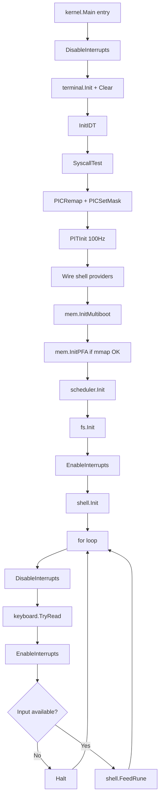
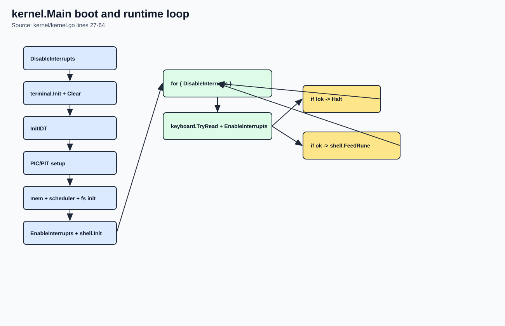
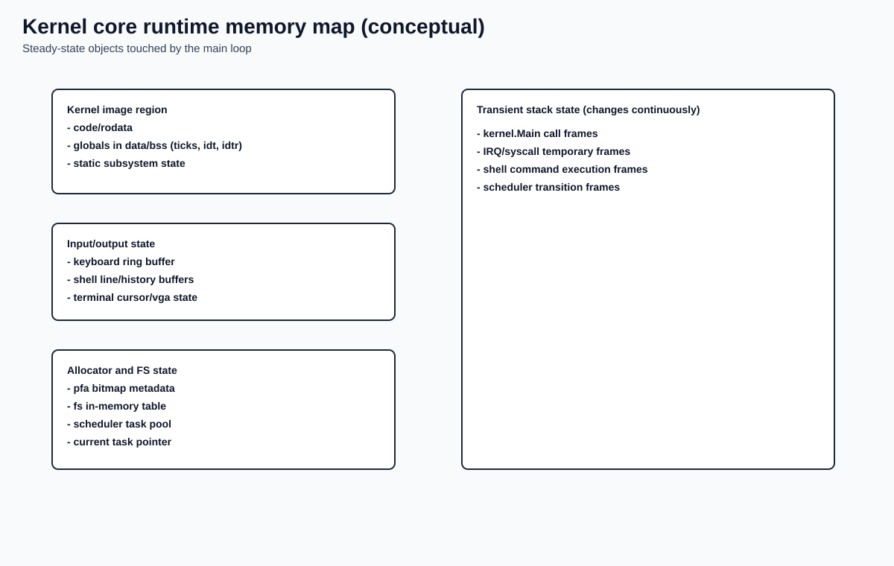

# Kernel Main Loop

## Why this chapter matters

`kernel.Main` is the orchestrator of the whole early kernel lifecycle.
It wires hardware, memory, scheduler, filesystem, and shell into one deterministic boot sequence.

## Source anchors (exact code references)

- Main initialization and runtime loop: `kernel/kernel.go:27` to `kernel/kernel.go:64`
- Interrupt enable/disable/halt assembly bridge: `boot/stubs_amd64.s:365` to `boot/stubs_amd64.s:383`
- Keyboard producer/consumer interface: `keyboard/irq.go:16` to `keyboard/irq.go:33`

## Theory companion

For background concepts used in this page, see:

- `docs/manual/03-kernel-core/theory-reference.md#7-critical-sections-and-cpu-idling`
- `docs/manual/03-kernel-core/theory-reference.md#3-irq-and-pic-model`
- `docs/manual/03-kernel-core/theory-reference.md#4-pit-timer-model`

## What `kernel.Main` actually does

The current execution order in code is:

1. `DisableInterrupts()`
2. `terminal.Init()` and `terminal.Clear()`
3. `InitIDT()`
4. `SyscallTest()`
5. `PICRemap(0x20, 0x28)`
6. `PICSetMask(0xFC, 0xFF)`
7. `PITInit(100)`
8. Shell wiring:
   - `shell.SetTickProvider(GetTicks)`
   - `shell.SetProgramRunner(RunProgram)`
9. Memory wiring:
   - `mem.InitMultiboot(multibootInfoAddr)`
   - `mem.InitPFA()` (only if MB2 parsing succeeds)
10. `scheduler.Init()`
11. `fs.Init()`
12. `EnableInterrupts()`
13. `shell.Init()`
14. enter infinite runtime loop

## Why this order is important

- IDT is initialized before enabling interrupts, so incoming IRQs have valid handlers.
- PIC/PIT are configured before `EnableInterrupts()`, so timer IRQs are meaningful.
- Memory map and PFA initialization happen before systems that may allocate pages.
- Shell starts only after subsystems it depends on are available.

## Boot-to-loop flow (Mermaid)



Rendered image:



## Runtime loop semantics

In steady-state loop:

- keyboard IRQ handler pushes runes into ring buffer
- main loop polls with interrupts briefly disabled
- if no key is available, `Halt()` executes `hlt`
- next hardware interrupt wakes CPU and loop continues

This is a low-complexity idle strategy that avoids tight busy waiting.

## Memory map of core runtime state

The map below is conceptual (not exact addresses), focused on ownership and purpose.

```text
Kernel image memory
- code and rodata
- global state in data/bss

Core global runtime state
- kernel.ticks (timer tick counter)
- kernel.idt[256] + kernel.idtr
- scheduler task table/pool/currentTask
- shell line buffer + history ring buffer
- keyboard ring buffer
- fs in-memory metadata table
- mem allocator bitmap/metadata (if initialized)

Transient stack state
- current kernel stack frames
- interrupt trap frames during IRQ/syscall entry
```

Rendered memory map image:



## Failure modes to reason about

- If interrupts are enabled before IDT/PIC setup, CPU can fault on first IRQ.
- If memory map parsing fails, `InitPFA()` is skipped and page allocation commands fail safely.
- If keyboard buffer is empty and `hlt` is removed, CPU load increases due to polling.

## Related files

- `kernel/kernel.go`
- `boot/stubs_amd64.s`
- `keyboard/irq.go`
