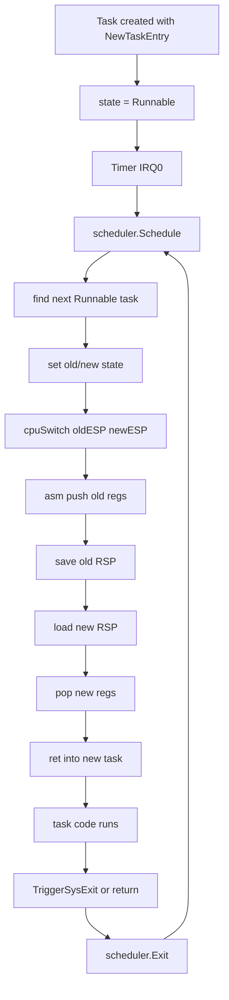
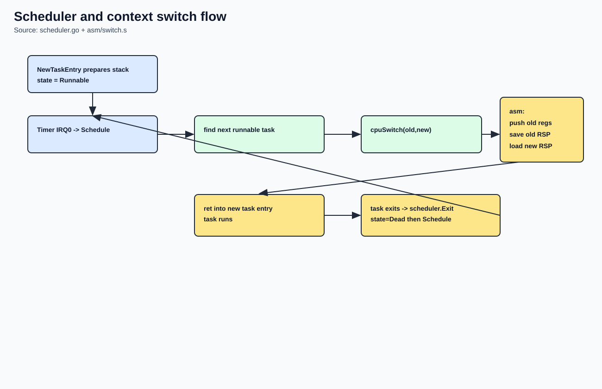
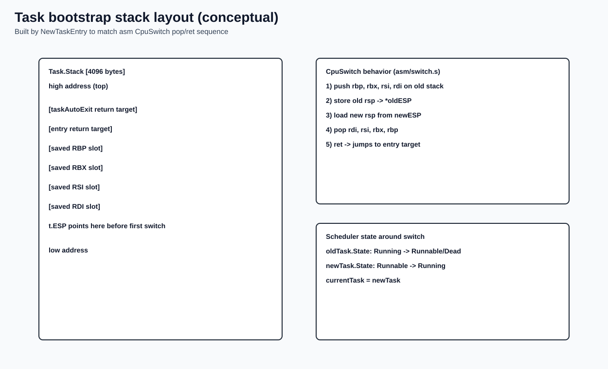

# Scheduler and Tasks

## Why this chapter matters

This scheduler defines how execution moves between tasks.
Even with minimal features, stack layout and context switch semantics must be exact.

## Source anchors (exact code references)

- Task model/init/create/schedule: `kernel/scheduler/scheduler.go:5` to `kernel/scheduler/scheduler.go:166`
- Assembly context switch: `asm/switch.s:9` to `asm/switch.s:24`
- Program launch bridge (`run hello`): `kernel/task_runner.go:14` to `kernel/task_runner.go:37`

## Theory companion

For the execution-model theory behind this page, see:

- `docs/manual/03-kernel-core/theory-reference.md#8-context-switch-theory`
- `docs/manual/03-kernel-core/theory-reference.md#6-trap-frame-concept`
- `docs/manual/03-kernel-core/theory-reference.md#7-critical-sections-and-cpu-idling`

## Task model

Each task stores:

- `ID`
- `ESP` (saved stack pointer value)
- `State` (`Runnable`, `Running`, `Waiting`, `Dead`)
- private stack `[4096]byte`

Task 0 is created by `scheduler.Init()` as the initial running task.

## How a new task stack is built

`NewTaskEntry(entry uintptr)` sets up stack memory manually:

1. compute stack top and 16-byte alignment
2. push fallback return address (`taskAutoExit`)
3. push entry return target (so `ret` enters task function)
4. reserve four 8-byte slots for registers restored by `CpuSwitch` (`RDI`, `RSI`, `RBX`, `RBP`)
5. store resulting pointer in `t.ESP`

This is why task bootstrap works without a high-level runtime scheduler.

## Scheduler and switch flow (Mermaid)

Rendered image:

## Memory map: task stack bootstrap layout

Rendered memory map image:

Conceptually, at `t.ESP` we store (low -> high address):

- saved `RDI`
- saved `RSI`
- saved `RBX`
- saved `RBP`
- return target: task entry function
- fallback return target: `taskAutoExit`

After `cpuSwitch` restores registers and executes `ret`, execution enters task entry.

## Scheduling logic and edge behavior

- round-robin search starts from current task index + 1
- if no runnable task found:
  - if current is dead: fallback to task 0
  - else: keep current task
- `MaxTasks = 16`, static pool avoids heap allocation dependence

Theoretical note:

- current policy is simple round-robin fairness, not priority-based scheduling.
- preemption entry point is timer IRQ0, while task exit is an explicit software path.

## User-visible entry path

Shell `run hello` path:

1. `shell` invokes program runner callback
2. `kernel.RunProgram` validates program name
3. `scheduler.NewTask(programHello)` allocates task
4. new task prints through syscall and exits

## Related files

- `kernel/scheduler/scheduler.go`
- `asm/switch.s`
- `kernel/task_runner.go`
