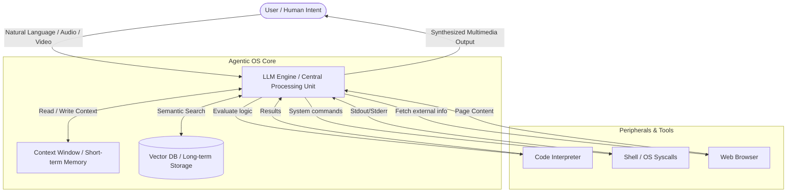
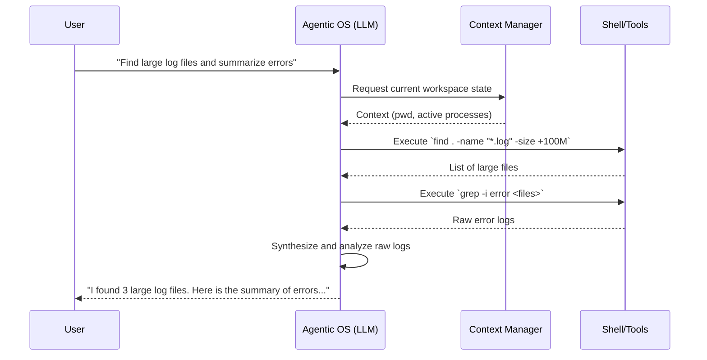

# Agentic OS (LLM OS) Architecture Concept

## Overview
As proposed in [Issue #102](https://github.com/dmarro89/go-dav-os/issues/102), the vision for v0.5.0 and beyond is to explore the concept of an "Agentic OS." In an Agentic OS, the user interacts with the operating system through an open conversation, using natural language to express intent rather than formulating rigid terminal commands. The OS Agent leverages contextual awareness of existing commands to execute tasks and provide structured, human-readable outputs.

This concept is heavily inspired by Andrej Karpathy's "LLM OS" vision, which reimagines the traditional operating system architecture by positioning a Large Language Model (LLM) at the core, serving as the central orchestrator (CPU).

## Architectural Paradigm Shift
Traditional operating systems are deterministic, relying on strict code execution paths. The Agentic OS introduces a probabilistic paradigm, where execution is driven by language understanding, reasoning, and inference. This makes the OS highly flexible, allowing it to interpret ambiguous user requests and plan complex, multi-step actions autonomously.

### System Architecture Diagram

### Core Components Analogy
In the LLM OS model, traditional hardware and software abstractions are mapped to AI-driven equivalents:

*   **CPU (Central Processing Unit) -> The LLM Engine**
    The core logic engine is the Large Language Model itself (e.g., GPT-4, Llama). It interprets natural language instructions, acts as a task planner, orchestrates interactions between components, and generates final responses.
    
*   **RAM (Random Access Memory) -> Context Window**
    The LLM's context window acts as the active memory. It holds the current conversation history, immediate instructions, and relevant system state required for the active processing cycle.
    
*   **File System (Storage) -> Vector Databases / Embeddings**
    Long-term memory and the file system are managed via vector databases. System documentation, user files, and historical interactions are stored as embeddings (e.g., Ada-002), allowing the LLM to search and retrieve relevant data using semantic similarity.
    
*   **Peripherals & Userland -> Agentic Tools**
    The OS is equipped with tools that the LLM can invoke to perform concrete actions. These include:
    *   **Shell/Terminal Execution:** To run underlying system commands safely.
    *   **Code Interpreter:** To write and execute scripts dynamically.
    *   **Web Browser:** To fetch external information.
    *   **Calculators/APIs:** For deterministic computations.
    
*   **I/O (Input/Output) -> Multimodal Interfaces**
    Sensory inputs (audio, video, text) and outputs replace traditional keyboards and monitors. The user can speak to the OS, provide images, and receive rich, multimodal feedback.

## User Experience (UX) & Execution Flow
The primary interaction model shifts from a Command Line Interface (CLI) or Graphical User Interface (GUI) to a **Conversational User Interface (CUI)**. 
- **Intent vs. Command:** The user states what they want to achieve (e.g., "Find all large log files and summarize the errors"), and the Agentic OS determines the necessary steps (`find`, `grep`, `awk`), executes them invisibly, and presents the final summary.
- **Contextual Awareness:** The OS maintains the context of the user's workspace, knowing which files are open, what the previous commands were, and what the user's overall goals are.

### Workflow Sequence Diagram

## Implementation Architecture for Go-Dav-OS
To implement this in `go-dav-os` starting from v0.4.0, a modular architecture must be designed to bridge the Go kernel and the AI agent:

1.  **Agent Daemon (User-mode Process):** 
    Introduce an AI agent daemon running as a privileged user-mode task. This daemon handles natural language processing, interacts with the LLM API, and orchestrates tasks.
    
2.  **Syscall / Shell Interception:** 
    The agent requires a mechanism to securely invoke internal OS APIs and shell built-ins. Instead of typing commands, the daemon communicates directly with the shell runtime via Inter-Process Communication (IPC).
    
3.  **Context Management Subsystem:** 
    Develop a lightweight context aggregator that constantly tracks the system state (memory usage, open file descriptors, active processes) and formatting it into a JSON or prompt-friendly structure to be injected into the LLM's context window.
    
4.  **Vector Storage (VFS Extension):** 
    Integrate a minimal vector search capability within the Virtual File System (VFS). This allows files and past commands to be indexed locally using embeddings, enabling the LLM to search for files by intent rather than exact paths.

5.  **Security, Sandboxing & Permissions:** 
    Because LLMs are probabilistic and prone to hallucinations, commands generated by the LLM must be sandboxed.
    *   **Dry-run execution:** The LLM proposes commands which are evaluated for safety before execution.
    *   **Privilege boundaries:** The agent should run with least privilege, prompting the user via the UI for permission before performing destructive operations (e.g., `rm`, writing over system files).
